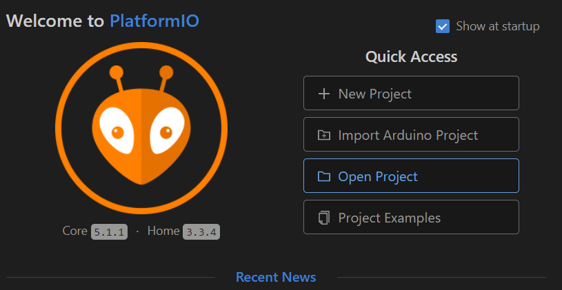
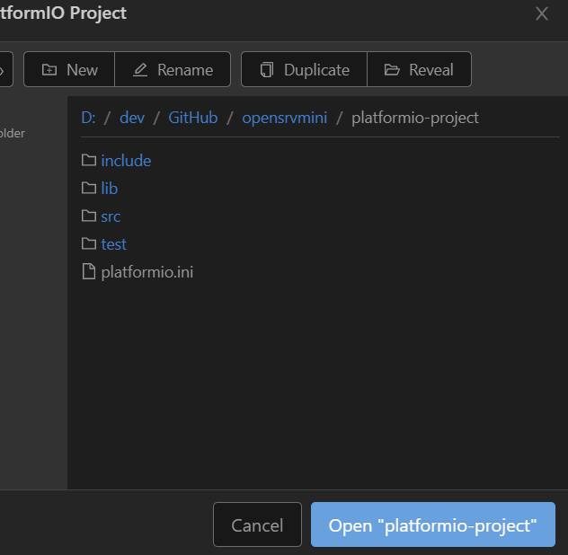

# OpenSRVmini

#WIP - Work in progress

## Description/Beschreibung

**(EN)** With OpenSRVmini you can measure the following in your caravan / motor home: temperature inside and outside, air humidity inside, 12V battery and the location using a gyro sensor.
The circuit communicates with a smartphone app via Bluetooth. A new firmware can be flashed via wifi via OTA update.

**(DE)** Mit OpenSRVmini kannst du folgendes in deinem Wohnwagen/Wohnmobil messen: Temperatur innen und außen, Lufgfeuchtigkeit innen, 12V Akku und die Lage anhand einem Kreiselsensor.
Die Schaltung kommuniziert über Bluetooth mit einer Smartphone-App. Über WLAN kann via OTA-Update eine neue Firmware geflashed werden.

## Hardware

* ESP32 "Dev Kit" (with wifi and bluetooth)
* BME280 (temperature, humidity and air pressure for indoor)
* MPU-6050 (3-axis-gyroscope)
* DS18B20 (waterproof for outdoor measurement)
* ADS1115 (4-Channel, 16-Bit AD, i2c)

**(EN)** I use the ADS1115 to measure the current because the EPS32's internal ADC is not accurate enough.

**(DE)** Ich verwende zur Messung des Stroms den ADS1115, da der interne ADC des EPS32 nicht genau genug ist.

## Software

Using VSCode with installed Platform IO Extension for development.
PlatformIO supports the Arduino Framework which makes it more easy to access allready supported devices.

* https://code.visualstudio.com/
* https://platformio.org/

# Startup Hints

After cloning the repository you can open the platformio-project folder as a project:

  

Once the project opened one way to use Platform IO environment is using the taskbar:

Right from the GIT symbols the Platform IO Icons are shown.
* House: Go TO PlatformIO home
* Checkmark : Compile current project using selected Environment (later here)
* Arrow: Compile current project and upload to ESP using selected Environment (later here)
* Trashcan: Clean current Project
* Connector Plug: Show ESP Serial Monitor interface
* Square: Open Terminal (less used)
* Folder Symbol with env:.... : Select active environment 

### Environment 

Please use https://platformio.org/ or https://docs.platformio.org/en/latest/projectconf/index.html for detailed descriptions. For this project so far just the info, that it will have multiple environments configured, depending for developer and connection.
Each section like [env:esp32dev-ota] in platformio.ini describes a usable environment, which can be used. This makes it more easy to switch between OTA upload or different serial ports.

## Facebook-Group/-Gruppe

Only in german / nur in Deutsch: https://www.facebook.com/groups/opensrv

